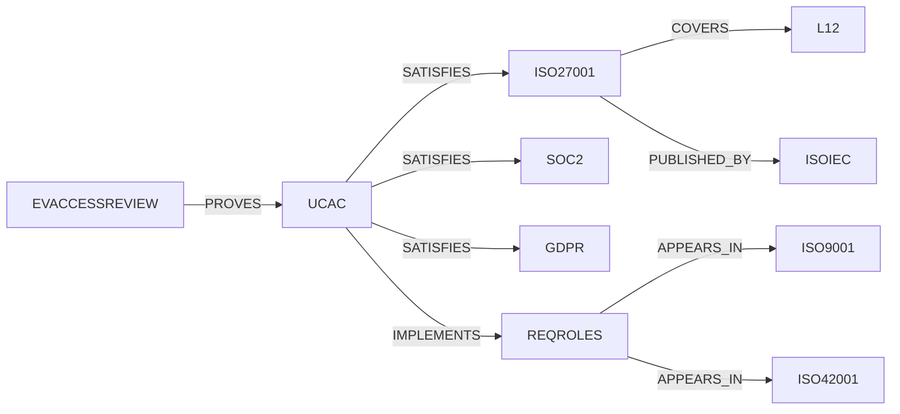

# Output 2 — Standards Knowledge Graph

The knowledge graph turns the flat registry into a navigable network so the
Nirva engine can answer questions like *"if I implement this control, which
standards move toward compliance, and what evidence do I still owe?"*

Source of truth: the JSON data layer + [`../graph.py`](../graph.py) (loader,
validator, query API). Run `python -m standards_kb.graph --export edges.json`
to materialize the graph for Neo4j, NetworkX, RDF, or a property graph DB.

## 2.1 Node types

| Node | Key | Count | File |
|---|---|---|---|
| Organization | `id` (e.g. `ISO`) | 61 | organizations.json |
| Standard | `id` (e.g. `ISO27001`) | 73 | standards.json |
| Domain | `L1`–`L20` | 20 | taxonomy.json |
| Requirement | `REQ-*` | 19 | common_requirements.json |
| Control | `UC-*` | 20 | controls.json |
| Evidence | `EV-*` | 18 | evidence.json |
| ERP Module | name | 16 | erp_mapping.json |
| Conflict | `CON-*` | 12 | conflicts.json |

## 2.2 Edge types (predicates)

```
(Standard)   -[:PUBLISHED_BY]->    (Organization)
(Standard)   -[:COVERS]->          (Domain)            # 20-domain taxonomy
(Requirement)-[:APPEARS_IN]->      (Standard)          # common DNA
(Control)    -[:IMPLEMENTS]->      (Requirement)
(Control)    -[:IN_DOMAIN]->       (Domain)
(Control)    -[:SATISFIES]->       (Standard)          # the crosswalk
(Evidence)   -[:PROVES]->          (Control)
(ERP-Module) -[:RUNS_CONTROL]->    (Control)
(ERP-Module) -[:OPERATIONALIZES]-> (Standard)
(Standard)   -[:TENSION_WITH]->    (Standard)          # conflicts
```

901 edges total, all validated — every reference resolves to an existing node.

## 2.3 The compliance inference chain

This is *why* the graph exists. A single path delivers multi-standard coverage:

```
Evidence ──PROVES──> Control ──SATISFIES──> Standard ──COVERS──> Domain
   │                    │
   └─ collected once    └─ IMPLEMENTS ─> Requirement <─APPEARS_IN─ many Standards
```

Worked example — collect **one** access-review log (`EV-ACCESSREVIEW`):

1. `EV-ACCESSREVIEW —PROVES→ UC-AC` (Access Control)
2. `UC-AC —SATISFIES→` ISO 27001, NIST 800-53, SOC 2, PCI DSS, CIS v8, GDPR,
   NIST CSF, HIPAA — **8 standards from one artifact.**
3. Those standards `COVER` domains L12 Security, L13 Privacy, L4 People.

That traversal is the literal implementation of **One Evidence · Many
Standards**.

## 2.4 Example queries (already implemented in `graph.py`)

```python
from standards_kb.graph import Graph
g = Graph.load()

g.standards_for_domain("L14")     # every AI standard
g.controls_for_standard("SOC2")   # controls that move SOC 2 forward
g.evidence_for_standard("ISO27001")  # the evidence pack for ISO 27001
g.reuse_factor("UC-IM")           # 9 — incident mgmt satisfies 9 standards
```

## 2.5 Mermaid view (excerpt)



Generate a live snippet with `python -m standards_kb.graph --mermaid`.

## 2.6 Recommended physical stores
- **Property graph (Neo4j / Memgraph):** best for traversal queries above.
- **RDF / OWL triple store:** if formal ontology & reasoning (SHACL) is needed.
- **Relational + JSONB (Postgres):** simplest path to embed inside NirvaCore;
  the edge export maps directly to an `edges(subject, predicate, object)` table.
